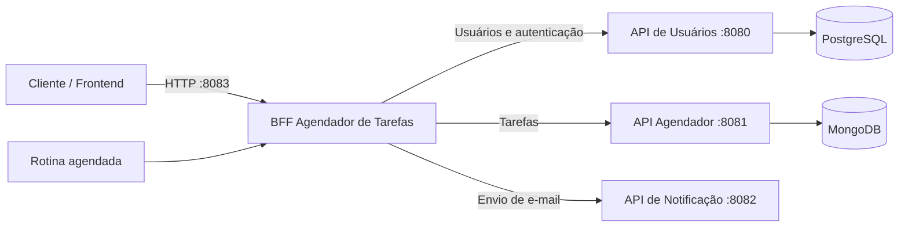

# BFF Agendador de Tarefas

Backend for Frontend responsável por oferecer uma interface única para cadastro de usuários, gerenciamento de tarefas e envio de notificações do ecossistema **Agendador de Tarefas**.

O BFF não mantém banco de dados próprio. Ele encaminha as requisições para as APIs de domínio por meio de clientes OpenFeign e executa uma rotina agendada que consulta tarefas futuras, solicita o envio dos e-mails e atualiza o status das notificações.

## Sumário

- [Arquitetura](#arquitetura)
- [Tecnologias](#tecnologias)
- [Pré-requisitos](#pré-requisitos)
- [Configuração](#configuração)
- [Execução com Docker Compose](#execução-com-docker-compose)
- [Execução local](#execução-local)
- [Documentação OpenAPI](#documentação-openapi)
- [Autenticação](#autenticação)
- [Endpoints](#endpoints)
- [Exemplos de uso](#exemplos-de-uso)
- [Rotina de notificações](#rotina-de-notificações)
- [Tratamento de erros](#tratamento-de-erros)
- [Testes](#testes)
- [Estrutura do projeto](#estrutura-do-projeto)
- [Solução de problemas](#solução-de-problemas)

## Arquitetura



O BFF possui três grupos de operações:

- **Usuários:** cadastro, login, consulta, atualização, endereços e telefones.
- **Tarefas:** criação, consulta, atualização, exclusão e alteração de status.
- **Notificações:** encaminhamento de e-mails e rotina automática para tarefas futuras.

## Tecnologias

- Java 17
- Spring Boot 4.0.7
- Spring Web MVC
- Spring Cloud OpenFeign
- Apache HttpClient 5 para chamadas Feign, incluindo `PATCH`
- SpringDoc OpenAPI / Swagger UI
- Docker e Docker Compose
- Lombok

## Pré-requisitos

Para executar toda a solução com containers:

- Docker Desktop ou Docker Engine com Docker Compose
- Os quatro repositórios no mesmo diretório pai

Estrutura esperada pelo `docker-compose.yml`:

```text
projetos-java/
├── agendador-tarefas/
├── bff-agendador-tarefas/
├── notificacao/
└── usuario/
```

Para executar apenas o BFF localmente:

- JDK 17
- APIs de usuários, tarefas e notificação acessíveis nas URLs configuradas

## Configuração

As configurações padrão estão em `src/main/resources/application.properties`.

| Propriedade | Variável de ambiente | Padrão | Descrição |
|---|---|---|---|
| `server.port` | `SERVER_PORT` | `8083` | Porta HTTP do BFF |
| `usuario.url` | `USUARIO_URL` | `http://localhost:8080` | URL-base da API de usuários |
| `tarefas.url` | `TAREFAS_URL` | `http://localhost:8081` | URL-base da API de tarefas |
| `notificacao.url` | `NOTIFICACAO_URL` | `http://localhost:8082` | URL-base da API de notificação |
| `cron.horario` | `CRON_HORARIO` | `0 0/5 * * * ?` | Expressão cron da rotina de notificações |
| `usuario.email` | `USUARIO_EMAIL` | `admin@admin.com` | Usuário técnico usado pela rotina agendada |
| `usuario.senha` | `USUARIO_SENHA` | `1234` | Senha do usuário técnico |

> As URLs devem conter somente protocolo, host e porta. Os caminhos `/usuarios`, `/tarefas` e `/email` já são acrescentados pelos clientes Feign.

Em ambientes compartilhados ou de produção, não mantenha credenciais no arquivo de propriedades. Use variáveis de ambiente ou um gerenciador de segredos.

## Execução com Docker Compose

Na raiz do BFF, construa as imagens e inicie toda a solução:

> Antes de iniciar, confira a variável da API de tarefas no Compose. A propriedade `tarefas.url` é sobrescrita por `TAREFAS_URL`; `AGENDADOR_TAREFAS_URL` não é reconhecida automaticamente pelo Spring Boot para essa propriedade.

```powershell
docker compose up --build -d
```

Confira o estado dos serviços:

```powershell
docker compose ps
```

Consulte os logs do BFF:

```powershell
docker compose logs -f bff-agendador-tarefas
```

Para encerrar os containers sem remover os volumes:

```powershell
docker compose down
```

Portas publicadas pelo Compose:

| Serviço | Porta no host |
|---|---:|
| BFF | `8083` |
| API de usuários | `8080` |
| API de tarefas | `8081` |
| API de notificação | `8084` |
| PostgreSQL | `5433` |
| MongoDB | `27017` |

## Execução local

Com as APIs dependentes em execução, inicie o BFF pelo Gradle Wrapper.

Windows:

```powershell
.\gradlew.bat bootRun
```

Linux ou macOS:

```bash
./gradlew bootRun
```

Para apontar o BFF local para endereços diferentes, defina as variáveis antes da execução. Exemplo em PowerShell:

```powershell
$env:USUARIO_URL = "http://localhost:8080"
$env:TAREFAS_URL = "http://localhost:8081"
$env:NOTIFICACAO_URL = "http://localhost:8082"
.\gradlew.bat bootRun
```

O BFF ficará disponível em `http://localhost:8083`.

## Documentação OpenAPI

Com o BFF em execução:

- Swagger UI: `http://localhost:8083/swagger-ui.html`
- Especificação OpenAPI: `http://localhost:8083/v3/api-docs`

No Swagger UI, use o botão **Authorize** para informar o token JWT nas operações protegidas.

## Autenticação

O login é realizado pela API de usuários através do BFF. A resposta é um token no formato:

```text
Bearer <token-jwt>
```

Envie esse valor integralmente no cabeçalho das operações autenticadas:

```http
Authorization: Bearer <token-jwt>
```

O BFF documenta o esquema Bearer no OpenAPI e encaminha o cabeçalho `Authorization`. A validação efetiva do token é realizada pelas APIs de domínio.

## Endpoints

Base URL local: `http://localhost:8083`

### Usuários

| Método | Rota | Autenticação | Resultado principal |
|---|---|---|---|
| `POST` | `/usuarios` | Não | Cadastra um usuário (`201`) |
| `POST` | `/usuarios/login` | Não | Autentica e retorna o token (`200`) |
| `GET` | `/usuarios?email={email}` | Bearer | Consulta um usuário (`200`) |
| `PUT` | `/usuarios` | Bearer | Atualiza os dados do usuário (`200`) |
| `DELETE` | `/usuarios/{email}` | Bearer | Exclui um usuário (`204`) |
| `POST` | `/usuarios/endereco` | Bearer | Cadastra um endereço (`201`) |
| `PUT` | `/usuarios/enderecos/{idEndereco}` | Bearer | Atualiza um endereço (`200`) |
| `POST` | `/usuarios/telefone` | Bearer | Cadastra um telefone (`201`) |
| `PUT` | `/usuarios/telefones/{idTelefone}` | Bearer | Atualiza um telefone (`200`) |

### Tarefas

| Método | Rota | Autenticação | Resultado principal |
|---|---|---|---|
| `POST` | `/tarefas` | Bearer | Cria uma tarefa (`201`) |
| `GET` | `/tarefas` | Bearer | Lista as tarefas do usuário autenticado (`200`) |
| `GET` | `/tarefas/eventos?dataInicial={data}&dataFinal={data}` | Bearer | Busca tarefas por período (`200`) |
| `PUT` | `/tarefas?id={id}` | Bearer | Atualiza uma tarefa (`200`) |
| `PATCH` | `/tarefas?id={id}&status={status}` | Bearer | Atualiza o status (`200`) |
| `DELETE` | `/tarefas?id={id}` | Bearer | Exclui uma tarefa (`204`) |

Valores aceitos em `status`:

- `PENDENTE`
- `NOTIFICADO`
- `CANCELADO`

O corpo de criação e atualização utiliza a data no formato `dd-MM-yyyy HH:mm:ss`. Os parâmetros de busca por período utilizam ISO 8601, por exemplo `2026-08-05T14:00:00`.

### E-mail

| Método | Rota | Resultado principal |
|---|---|---|
| `POST` | `/email` | Encaminha uma tarefa para notificação (`204`) |

Esse endpoint é usado pela orquestração de notificações e recebe o objeto completo de resposta de uma tarefa.

## Exemplos de uso

### 1. Cadastrar usuário

```bash
curl -X POST http://localhost:8083/usuarios \
  -H "Content-Type: application/json" \
  -d '{
    "nome": "Maria Silva",
    "email": "maria@example.com",
    "senha": "senha123",
    "enderecos": [],
    "telefones": []
  }'
```

### 2. Fazer login

```bash
curl -X POST http://localhost:8083/usuarios/login \
  -H "Content-Type: application/json" \
  -d '{
    "email": "maria@example.com",
    "senha": "senha123"
  }'
```

### 3. Criar tarefa

```bash
curl -X POST http://localhost:8083/tarefas \
  -H "Content-Type: application/json" \
  -H "Authorization: Bearer <token-jwt>" \
  -d '{
    "nomeTarefa": "Consulta médica",
    "descricao": "Levar os exames",
    "dataEvento": "10-08-2026 14:30:00"
  }'
```

### 4. Buscar tarefas por período

```bash
curl -G http://localhost:8083/tarefas/eventos \
  -H "Authorization: Bearer <token-jwt>" \
  --data-urlencode "dataInicial=2026-08-05T00:00:00" \
  --data-urlencode "dataFinal=2026-08-31T23:59:59"
```

### 5. Alterar o status de uma tarefa

```bash
curl -X PATCH "http://localhost:8083/tarefas?id=<id>&status=CANCELADO" \
  -H "Authorization: Bearer <token-jwt>"
```

## Modelos de dados

### Usuário

```json
{
  "nome": "Maria Silva",
  "email": "maria@example.com",
  "senha": "senha123",
  "enderecos": [],
  "telefones": []
}
```

### Endereço

```json
{
  "id": 1,
  "rua": "Rua das Flores",
  "numero": 100,
  "complemento": "Apto 10",
  "cidade": "São Paulo",
  "estado": "SP",
  "cep": "01000-000"
}
```

### Telefone

```json
{
  "id": 1,
  "ddd": "11",
  "numero": "999999999"
}
```

### Tarefa

Requisição:

```json
{
  "nomeTarefa": "Consulta médica",
  "descricao": "Levar os exames",
  "dataEvento": "10-08-2026 14:30:00"
}
```

Resposta:

```json
{
  "id": "6893a4d7",
  "nomeTarefa": "Consulta médica",
  "descricao": "Levar os exames",
  "dataCriacao": "05-08-2026 13:00:00",
  "dataEvento": "10-08-2026 14:30:00",
  "emailUsuario": "maria@example.com",
  "dataAlteracao": "05-08-2026 13:00:00",
  "statusNotificacaoEnum": "PENDENTE"
}
```

## Rotina de notificações

A aplicação habilita o agendamento com `@EnableScheduling`. Por padrão, a rotina roda a cada cinco minutos.

Fluxo executado:

1. Autentica o usuário técnico configurado em `usuario.email` e `usuario.senha`.
2. Calcula o período entre o horário atual mais 10 minutos e o horário atual mais 2 horas.
3. Consulta as tarefas desse período na API de tarefas.
4. Envia cada tarefa para a API de notificação.
5. Atualiza o status da tarefa para `NOTIFICADO`.

A frequência pode ser alterada pela variável `CRON_HORARIO`, usando uma expressão cron compatível com Spring.

## Tratamento de erros

Erros retornados pelas APIs integradas são convertidos pelo decoder Feign:

| Status da API integrada | Resposta do BFF | Significado |
|---:|---:|---|
| `401` | `401 Unauthorized` | Usuário não autorizado |
| `403` | `404 Not Found` | Recurso não encontrado |
| `409` | `409 Conflict` | Atributo ou recurso já existente |
| Outros | `500 Internal Server Error` | Falha não mapeada ou indisponibilidade |

## Testes

Windows:

```powershell
.\gradlew.bat test
```

Linux ou macOS:

```bash
./gradlew test
```

Para gerar o artefato completo:

```powershell
.\gradlew.bat clean build
```

O JAR é gerado em `build/libs/`.

## Estrutura do projeto

```text
src/main/java/com/luizconde/bffagendadortarefas/
├── business/
│   ├── dto/                 # Contratos de entrada e saída
│   ├── CronService.java     # Orquestração periódica de notificações
│   ├── EmailService.java
│   ├── TarefasService.java
│   └── UsuarioService.java
├── controller/              # Endpoints REST e tratamento global de erros
└── infrastructure/
    ├── client/              # Clientes OpenFeign
    ├── enums/               # Status de notificação
    ├── exceptions/          # Exceções de integração
    └── security/            # Esquema Bearer da documentação OpenAPI
```

## Solução de problemas

### Resposta 404 ao acessar uma API integrada

Confira se as URLs-base não possuem caminhos duplicados. Use somente:

```text
USUARIO_URL=http://usuario:8080
TAREFAS_URL=http://agendador-tarefas:8081
NOTIFICACAO_URL=http://notificacao:8082
```

### O BFF inicia, mas não acessa outro container

Dentro de um container, `localhost` aponta para o próprio container. Use o nome do serviço definido no Compose, como `usuario`, `agendador-tarefas` ou `notificacao`.

### Containers encerram logo após a inicialização

Verifique estado e logs:

```powershell
docker compose ps -a
docker compose logs --tail 100
```

### Falha na rotina automática

Confirme:

- se o usuário técnico existe na API de usuários;
- se `USUARIO_EMAIL` e `USUARIO_SENHA` estão corretos;
- se as três APIs integradas estão disponíveis;
- se a expressão `CRON_HORARIO` é válida.
